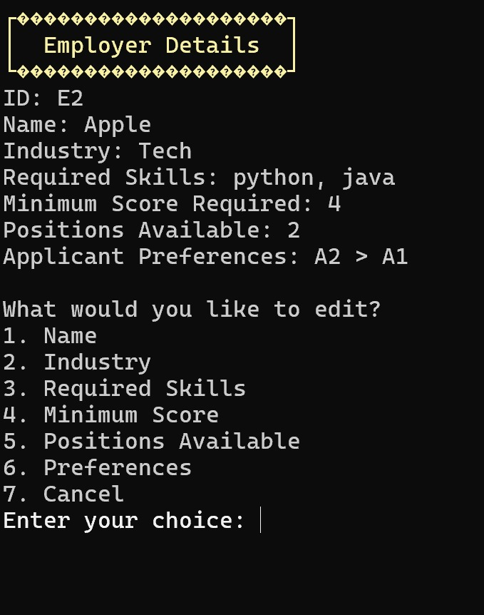
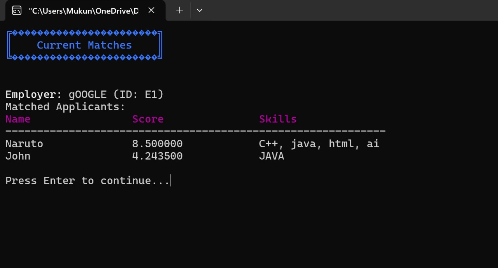

# Project Gale

**Project Gale** is a C++ implementation of the Gale-Shapley algorithm (Stable Marriage Problem) designed for matching applicants and employers based on their mutual preferences. Built with Code::Blocks, this console-based application provides a simple and structured way to understand stable matching logic in action.

---

## 🚀 Features

- Add and manage applicant and employer details
- Use Gale-Shapley algorithm for stable matching
- View final matches
- Store input and output data using text files
- Modular structure with header and source files

---

## 📂 Folder Structure

Project Gale/
├── include/ # Header files (class declarations)
│ ├── applicant.h
│ ├── employer.h
│ ├── matching.h
│ ├── menu.h
│ └── utils.h
│
├── src/ # Source files (logic implementations)
│ ├── applicant.cpp
│ ├── employer.cpp
│ ├── matching.cpp
│ ├── menu.cpp
│ └── utils.cpp
│
├── data/ # Sample input/output data
│ ├── applicants.txt
│ ├── employers.txt
│ └── matches.txt
│
├── main.cpp # Entry point of the program
├── Project Gale.cbp # Code::Blocks project file
└── .gitignore # Git ignored files and folders

---

## 💡 How to Run

### 🛠 Requirements

- C++11 or later
- [Code::Blocks IDE](http://www.codeblocks.org/)

### ▶ Steps

1. Open `Project Gale.cbp` using Code::Blocks.
2. Press **F9** to build and run the project.
3. Use the menu options in the terminal to interact with the system.

---

The matches will be saved in **`data/matches.txt`** after execution.

---

## 🧠 Algorithm

This project implements the **Gale-Shapley algorithm** (also known as the Deferred Acceptance Algorithm), which ensures that no applicant-employer pair would rather be matched with each other over their current match — thereby ensuring a stable matching.

---

## 📸 Screenshots

### 🧭 Main Menu

### ✍️ Applicant Entry

### 📊 Final Matches

---

## 📜 License

This project is released under the **MIT License**. Feel free to use, modify, and distribute it as needed.

---

## 🤝 Contributions

Pull requests, issues, and suggestions are welcome. This is a learning project — let's make it better together!

---

## 🙋‍♂️ Author

Mukund Nigam B-12 Batch  
Gaurav Solanki B-12 Batch
Bhavyanshika Gupta B-12 Batch
Vanshika Chauhan B-12 Batch
APS Lab 2025  

